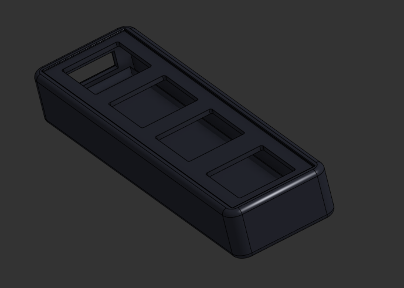

# ION

Hi! I am Aahil, And I made Ion!

Ion(Pad) is a multi usage macropad that will have a selector wheel, customizable keys, and even more along the way.

## How will you use the IonPad?
You press the keys for Copy, paste, cut, and the knob for volume control! (this is what it does now.)
Soon it will have a nice software and faster click times for Geometry Dash, Osu and even more!

Also, All these features except from the "Copy, Paste, Cut, Volume Controls" work in my example firmware, but I will do the rest of the features when the parts come.
And then, "you still didn't use the selector wheel, do you mean the rotary knob is for then you should fix it - @PenguinMo"  Selector Wheel is gonna be a overlay UI coming out after I get the parts to make and test it out, and that is what the rotary knob will be used for after i recieve the parts, but as for now, its a Volume Control.

## Why did I make this?
I want to help other people make a macropad, so I made this so other people can base off this project, and especially the software.

p.s reviewers heres the cad onshape link: [here](https://cad.onshape.com/documents/6712e51ebf114c6a4c189719/w/483d595bdc89a78519b30786/e/276eeeabe244c6235e0d0a11?renderMode=0&uiState=699f2c64c889dd3bfd28ac00)
